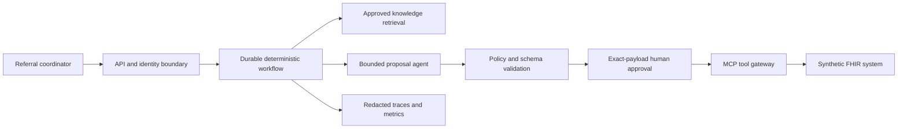

# CareFlow AI architecture

## Decision summary

CareFlow AI is a hybrid system: deterministic services own validation, authorization, state transitions, approvals, and side effects; a bounded model adapter performs language-oriented proposal work. The POC runs locally with deterministic synthetic adapters. The target AWS architecture uses CloudFront/WAF, API Gateway, Lambda, Step Functions, EventBridge, Bedrock AgentCore, Bedrock, S3/Knowledge Bases, DynamoDB/KMS, and CloudWatch/OpenTelemetry.

## Invariants

1. The model cannot diagnose, prioritize clinical urgency, or write to a system of record.
2. Every consequential action requires a current policy allow decision and exact-payload human approval.
3. A changed payload invalidates approval.
4. Every write is idempotent. An uncertain outcome is reconciled, never blindly retried.
5. Retrieval is tenant/specialty scoped and returns only approved, effective content.
6. Patient narrative is excluded from standard logs and traces.
7. The existing manual queue remains available during service failure.

## Logical flow

## Target AWS deployment

- Separate sandbox, development, test, and production accounts.
- Workforce identity federates into Cognito/OIDC and environment-specific roles.
- API Gateway validates access tokens; Lambda enforces business scope.
- Step Functions Standard owns the durable workflow and approval wait.
- AgentCore Runtime hosts the agent adapter; AgentCore Gateway exposes narrowly scoped MCP tools.
- DynamoDB stores workflow and approval state with point-in-time recovery.
- S3 is the governed record for approved source documents; the vector index is rebuildable.
- CloudWatch receives service telemetry and OTEL-compatible traces with allowlist redaction.

## Local-to-cloud seams

`ModelAdapter`, `KnowledgeRetriever`, `PolicyEngine`, `WorkflowStore`, and `ToolGateway` are explicit boundaries. The local implementation is deterministic and testable. AWS implementations must preserve the same contracts and invariants.
